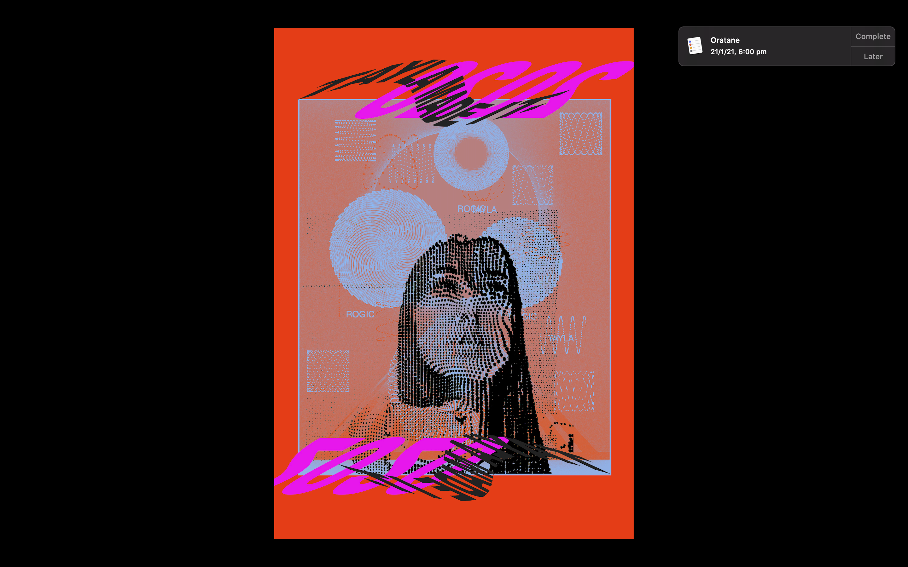

# Hello World

In Hello World, I was to create a poster that was self portraiture, representative of me and my design practice. My love for modular design and art involving geometric and isometric shapes has defined a certain aesthetic in my design work, and helped me find fondness for other practices like code. Creative coding and generative art has become an area I have been able to create interesting imagery. As a designer I love to learn, and I love to be challenged. I am constantly developing new skills, and that was the primary inspiration for this design. 
