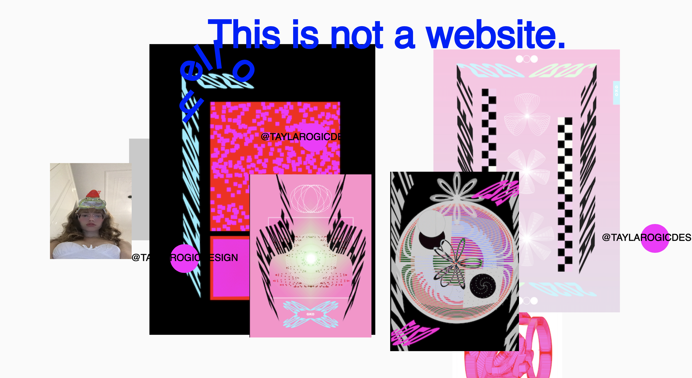

[This Is Not A Website](https://taylarogic.github.io/GKO/taylamade/) is a project dedicated to the experimentalism when learning new skills. It is a non traditional online gallery featuring playful designs, experiments and happy accidents made by me. The objective was to create an unconventional space to demonstrate my learning and design process, rather than the traditional designers orderly and refined website of serious and finished work. Unlike tailor made (a product that is perfected and intricate), Tayla Made is messy and fun, and a magnification of myself, my ideas, and the experimentalism that happens when I am working. 
