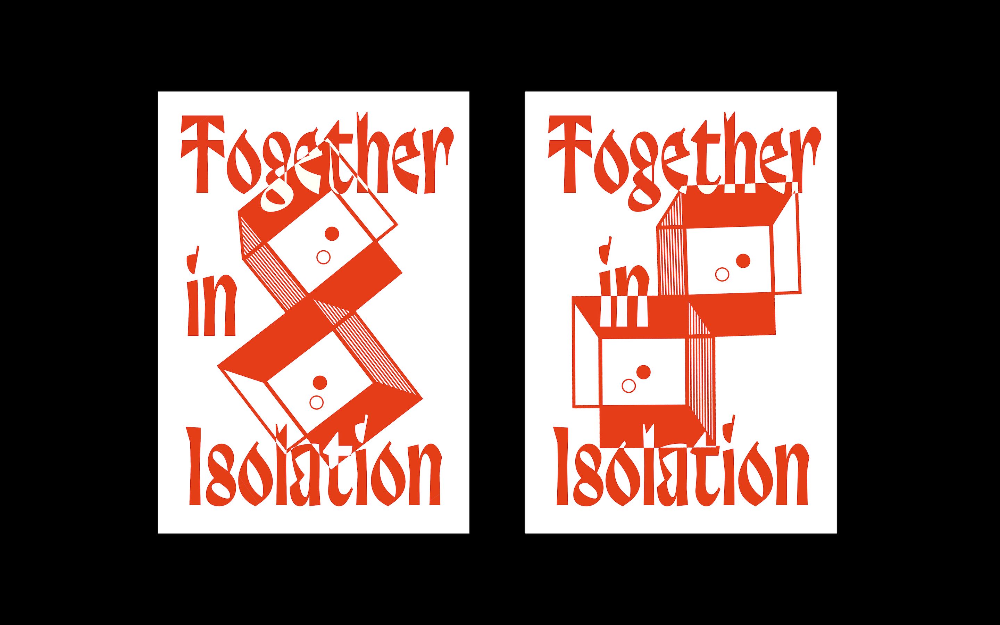

Together in Isolation is a campaign to promote self isolation during covid for the benefit of eventual togetherness. It is a reminder that it is a shared experience, dependant on collective cooperation. Therefore two cubes resembling homes are connected but seperate. 
